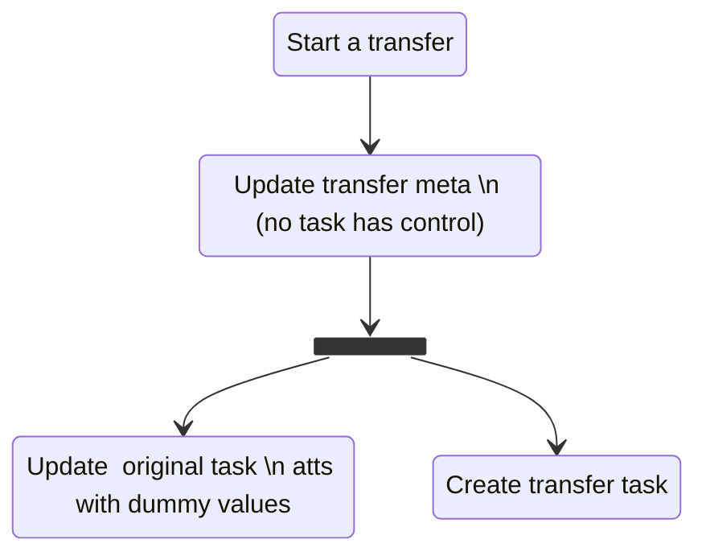

## Task router listeners
- [transferListener](#transferListener)


## transferListener
This listener is focused on handling the interactions related to task transfers. Following we'll describe how transfers work internally, and how this listeners handle the interactions.

#### Chat transfers
Twilio does not supports chat transfers out of the box, so we have our own implementation of them.

At the time of writing, Aselo does not supports "warm transfer" of chat based conversations. This means that all chat transfers are "cold" transfers: the transfer is issued without asking. However, if the transfer targets a particular worker, this target worker will get to decide if the task is accepted or rejected. In the case of rejecting it, the transfer is aborted.

When a user requests a "chat transfer":
- The Flex client will update the task attributes via [setTransferMeta](https://github.com/techmatters/flex-plugins/blob/8b9795dfb984d0b249a594774756432c55648074/plugin-hrm-form/src/utils/transfer.ts#L126). This function basically adds relevant information to the task attributes:
  ```
    transferStarted: true,
    transferMeta: {
      originalTask: task.taskSid,
      originalReservation: task.sid,
      originalCounselor: task.workerSid,
      originalCounselorName: counselorName,
      originalConversationSid: task.attributes.conversationSid || task.attributes.channelSid, // save the original conversation sid, so we can cleanup the listeners if transferred succesfully
      sidWithTaskControl: mode === transferModes.warm ? '' : 'WR00000000000000000000000000000000', // if cold, set control to dummy value so Task Janitor completes this one
      transferStatus: mode === transferModes.warm ? transferStatuses.transferring : transferStatuses.accepted,
      formDocument: documentName,
      mode,
      targetType,
    }
  ```
  NOTE: This could/should be moved to the transfer handler, to be in line with our "take responsibilities away from Flex" philosophy.
- The Flex client issues a request to `/transferChatStart` function, which will:
  - Create a new Twilio task, with the corresponding routing configuration, depending on the "transfer target" (either a particular worker or an entire queue).
    This task will contain the `channelSid` and `proxySessionSID` used to reach the child. It will also contain ALL the attributes from the original task (including the `transferMeta` object from above). For the purpose of this docs, we'll refer to this task as the "transfer task".
  - Set the original task attributes with the values
    ```
    channelSid: 'CH00000000000000000000000000000000'
    proxySessionSID: 'KC00000000000000000000000000000000'
    ```
    This is done in order to avoid "shutting down the channel" in case the transfer is successful.
    For the purpose of this docs, we'll refer to this task as the "original task".

<!--  -->



From this point, what happens to both, the "original" and "transfer" tasks is determined by the task router listener, based on the events fired by the reservation of our "transfer task". There are three different possible scenarios:
- Chat transfer targets a worker and
  - The target worker accepts the "transfer task": 
    - The "original task" is completed. The channel is kept open because we set `channelSid` to a dummy value.
    - The "transfer task" will take control of this conversation after it is accepted, via [takeControlIfTransfer](https://github.com/techmatters/flex-plugins/blob/cf8ee2550ce4b10d2248664e3eab8990981e9f23/plugin-hrm-form/src/transfer/setUpTransferActions.tsx#L145C7-L145C28). NOTE: This could/should be moved to the transfer handler, to be in line with our "take responsibilities away from Flex" philosophy.
  - The target worker rejects the "transfer task", the reservation expires or the task is canceled (all handled by `/taskrouterListeners/transfersListener`):
    - The "original task" `channelSid` and `proxySessionSID` are updated to be the actual ones.
    - The "transfer task" `channelSid` and `proxySessionSID` are updated to be the dummy ones.
    - Both tasks are updated with new `transferMeta`: 
      ```
      sidWithTaskControl: originalAttributes.transferMeta.originalReservation,
      transferStatus: 'rejected',
      ```
    - The "transfer task" is canceled.

  <!--  -->

  ```mermaid
    stateDiagram-v2
        state if_accepted <<choice>>
        WorkerTransfer: Transfer to worker

        WorkerTransfer --> if_accepted
        if_accepted --> Rejected: if rejected
        if_accepted --> Accepted: if accepted

        state Rejected {
            RejectedTransferTask: Transfer task
            RejectedOriginalTask: Original task
            RejectedUpdateTransferMeta: Update transfer meta \n (original task has control)
            RejectedSetControlAttributes: Update original task \n atts with channel values
            RejectedSetDummyAttributes: Update transfer task \n atts with dummy values
            RejectedCancelTask: Cancel transfer task
            RejectedTaskWithControl: Original task owns \n the conversation

            RejectedOriginalTask --> RejectedUpdateTransferMeta
            RejectedUpdateTransferMeta --> RejectedSetControlAttributes
            RejectedSetControlAttributes --> RejectedTaskWithControl

            RejectedTransferTask --> RejectedSetDummyAttributes
            RejectedSetDummyAttributes --> RejectedCancelTask
            RejectedCancelTask --> [*]
        }
        state Accepted {
            AcceptedTransferTask: Transfer task
            AcceptedOriginalTask: Original task
            AcceptedUpdateTransferMeta: Update transfer meta \n(transfer task has control)
            AcceptedCompleteTask: Complete original task
            AcceptedTaskWithControl: Transfer task owns \n the conversation

            AcceptedOriginalTask --> AcceptedCompleteTask
            AcceptedCompleteTask --> [*]

            AcceptedTransferTask --> AcceptedUpdateTransferMeta
            AcceptedUpdateTransferMeta --> AcceptedTaskWithControl
        }
  ```
- Chat transfer targets a queue:
  Logic follows the same path as accepted worer-transfer, but with the two steps occurring at different times.
  - Upon the "transfer task" entering the target queue, the "original task" is completed. The channel is kept open because we set `channelSid` to a dummy value.
  - Once another counselor accepts this new task, the "transfer task" will take control of this conversation after it is accepted, via [takeControlIfTransfer](https://github.com/techmatters/flex-plugins/blob/cf8ee2550ce4b10d2248664e3eab8990981e9f23/plugin-hrm-form/src/transfer/setUpTransferActions.tsx#L145C7-L145C28).
  <!--  -->
  ```mermaid
    stateDiagram-v2
      QueueTransfer: Transfer to queue

      QueueTransfer --> _: Transfer task \n enters queue

      state _ {
          TransferTask: Transfer task
          OriginalTask: Original task
          UpdateTransferMeta: Update transfer meta \n(transfer task has control)
          CompleteTask: Complete original task
          TaskWithControl: Transfer task owns \n the conversation

          OriginalTask --> CompleteTask
          CompleteTask --> [*]
          --
          TransferTask --> UpdateTransferMeta
          UpdateTransferMeta --> TaskWithControl
      }
  ```

Interactions with other parts of our system:
- [hasTaskControl](https://github.com/techmatters/serverless/blob/2e2dc5ec0d71c2333fd973c1cda4896601a7ecfd/functions/transfer/helpers.private.ts#L31C14-L31C28) function is a helper used to determine if a given task, in case of being part of a transfer, "controls the conversation".
  - Task is part of a transfer and this is not resolved yet, then NONE of "original task" nor "transfer task" has task control.
  - The transfer has been accepted, then "original task" does NOT has task control.
  - The transfer has been rejected, then "transfer task" does NOT has task control.
  
  This helper is used in `/taskrouterListeners/janitorListener`. If a task does not has the control, then no matter what events this raises, the janitor should NOT tear down this chat channel, since there will be (or already is) a task that will control it, and the channel should be preserved in order to allow the conversation to continue.
